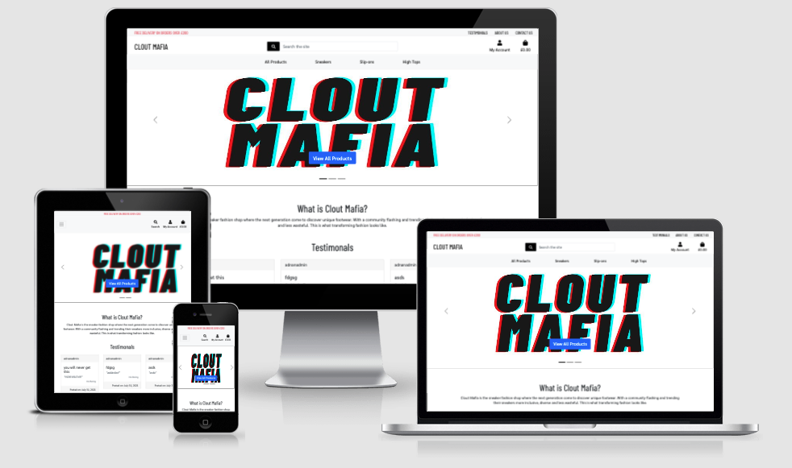

<h1 align="center">Milestone Project 4 - Clout Mafia</h1>

[View project here](https://clout-mafia-ms4.herokuapp.com/)

This eCommerce site is based on advertising and selling exclusive sneakers. The target market audience has a unique market for individuals who have a taste in fashion. Being able to register/login/log out as well as adding/updating/deleting items from the inventory as well as the shopping basket. Giving users the different options of sneakers and sizes as well as being able to search for them to select from depending on availability. 

As the business is a startup, products sold will still be advertised but marked sold disabling and removing the opportunity to be repurchased. The reason for this approach is to build the hype for the user client tell and to showcase what users have missed out on. 

This site would be utilizing Python and Django which was taught from the Code Institute. I will also be using various technologies such as HTML5, CSS3, JQuery and Bootstrap. This project will be responsive and accessible to different size browsers and devices.

<h2 align="center">

## User Experience (UX)

### The Audience

The intended audience for this project is individuals who are into casual contemporary fashion, namely exclusive designer footwear and streetwear.

### User Objectives

To be able to find and purchase a pair of sneakers easily. Navigate through the site with a consistent layout and structure making the sneakers clear to be seen and accessible. When a pair of sneakers is selected, it will direct the user to a detailed product page, which would display a larger picture of the product, a description and sneaker size.

After having some items added to the basket, to be able to preview the selected sneakers and to see the total price. Once decided to make an order, to be able to go and check out and put in all the card details to purchase the items. To also have the ability to create an account and store the previous orders associated with the account.

Having an additional option to post a testimonial about the service/website to share with other users and having it displayed on the home page to be seen by other users.

### My Objectives

To create a site that would allow a user to register and have a profile on the site. For the user to be able to search for a product and select it to find out more details about it. Either on the products page or the product detail page, the user would be able to add the product to the shopping basket. Then having the user then go to checkout and purchase their order.

The site would have a CRUD software architectural style (Create, Read, Update and Delete) for basic operations of persistent storage with the products being added by the admin user. Validation would be included in the site when it comes to adding products, user details and user card details. When a user sends an email to the site admin, to have the subject automatically post to the database for analysing. 

### User Stories

The intended type of users which this website is targeted for are individuals who enjoy online shopping and have a unique taste is fashion.

1. As a user, I want to be able to view a list of products, so that I can purchase one of them.
1. As a user, I want to be able to view the details of an individual item, so I can see the price, description, product image and available size.
1. As a user, I want to be able to sort the sneakers, so I can identify the best priced and alphabetically 
1. As a user, I want to be able to sort a specific category of sneakers, so I can find the specific sneakers I am looking for
1. As a user, I want to be able to search by name and/or description, so I can find sneakers easily
1. As a user, I want to be able to see the number of results that appear from my search, so I can see how many sneakers are available from my search
1. As a user, I want to be able to select the size and quantity of a pair of sneakers, so I can ensure I purchase the right size and amount of my desired order
1. As a user, I want to be able to easily register for an account, so I can have a personal account within the site and be able to view my personal information
1. As a user, I want to be able to recover my password, so I can recover it if needed.
1. As a user, I want to be able to view a personalised profile page, so I can view my personal information as well as my order history
1. As a user, I want to be able to view the overall total of my shopping bag, so I can see my total spending
1. As a user, I want to be able to update my shopping bag at the checkout by updating the quantity of my order, so I can have the option to change my mind if I don’t want to spend as much
1. As a user, I want to be able to easily enter my payment details, so I can easily purchase my items
1. As a user, I want to be able to view an order confirmation after I have purchased my items, so I can verify my purchase order.
1. As a user, I want to be able to post a testimonial, so I can express my opinion of the service/website.
1. As a user, I want to be able to see the products that have already been sold, so I can see the other types of products I have missed out on and what this company has already sold
1. As a site owner, I want to be able to add a product, so I can a new pair of sneakers to my store
1. As a site owner, I want to be able to edit, update a product in my store, so I can amend the name, price, description, image and any other product details
1. As a site owner, I want to be able to delete a product, so I can remove the product from my store.
1. As a site owner, I want to be able to see a list of emails that get sent within the Django admin page, so I can see what users are mostly asking 

### Design
-   #### Colour Scheme
    -   The colour scheme I will be working with is mainly black and white to keep it simple and easy on the eyes. The concept is to make the images of the sneakers be the focus of the site.

-   #### Typography
    -   I have chosen to use [Barlow Condensed](https://fonts.google.com/specimen/Barlow+Condensed) and [Sarabun](https://fonts.google.com/specimen/Sarabun) font as the main fonts throughout the website with Sans Serif as the emergency font in the case for any reason the font is not being imported into the site correctly. Both [Barlow Condensed](https://fonts.google.com/specimen/Barlow+Condensed) and [Sarabun](https://fonts.google.com/specimen/Sarabun) are attractive fonts to use as it easy to clear and easy to read. [Barlow Condensed](https://fonts.google.com/specimen/Barlow+Condensed) would be used for all the headers of the site whereas [Sarabun](https://fonts.google.com/specimen/Sarabun) would be used for the rest of the content

-   #### Imagery
    -   The images that were used as based on the purpose of the site being focused on selling sneakers. All images have been taken personally as I would also be advertising sneakers that have been sold before this project. Other images for this project were taken from [Unsplash](https://unsplash.com/)

*   ### Wireframes

    #### Home Page - [View](https://github.com/adnanmuhtadi/milestone-project-4/blob/main/documentation/wireframes/home-page.pdf)

    - I altered the design during development by not including the categories under the testimonials as it was redundant while having the categories displayed permanently in the footer

    #### Register Page - [View](https://github.com/adnanmuhtadi/milestone-project-4/blob/main/documentation/wireframes/register-page.pdf)

    #### Login Page - [View](https://github.com/adnanmuhtadi/milestone-project-4/blob/main/documentation/wireframes/login-page.pdf)

    #### All Products Page - [View](https://github.com/adnanmuhtadi/milestone-project-4/blob/main/documentation/wireframes/all-products-page.pdf)

    - I altered the design during development as having 4 items in a row looked better than having 3 items in a row.

    #### Product Details Page - [View](https://github.com/adnanmuhtadi/milestone-project-4/blob/main/documentation/wireframes/product-details-page.pdf)

    #### Basket Page - [View](https://github.com/adnanmuhtadi/milestone-project-4/blob/main/documentation/wireframes/bag-page.pdf)

    - I altered the design during development and not included the quantity due to the fact it's not the purpose of the site.

    #### Checkout Page - [View](https://github.com/adnanmuhtadi/milestone-project-4/blob/main/documentation/wireframes/checkout-page.pdf)

    #### Order Confirmation Page - [View](https://github.com/adnanmuhtadi/milestone-project-4/blob/main/documentation/wireframes/order-confirmation-page.pdf)

    #### Superuser Add/Edit Product Page - [View](https://github.com/adnanmuhtadi/milestone-project-4/blob/main/documentation/wireframes/superuser-add-edit-product.pdf)

    #### Testimonials Page - [View](https://github.com/adnanmuhtadi/milestone-project-4/blob/main/documentation/wireframes/testimonials-page.pdf)

    - I altered the design during development as the form meant more meaningful when having ratings and title behind the message

    #### Shipping & Returns Page - [View](https://github.com/adnanmuhtadi/milestone-project-4/blob/main/documentation/wireframes/shipping-and-returns-page.pdf)

    #### Privacy Page - [View](https://github.com/adnanmuhtadi/milestone-project-4/blob/main/documentation/wireframes/privacy-page.pdf)

    #### Terms & Conditions Page - [View](https://github.com/adnanmuhtadi/milestone-project-4/blob/main/documentation/wireframes/terms-page.pdf)

    #### About Page - [View](https://github.com/adnanmuhtadi/milestone-project-4/blob/main/documentation/wireframes/about-page.pdf)

    #### Contact Us Page - [View](https://github.com/adnanmuhtadi/milestone-project-4/blob/main/documentation/wireframes/contact-us-page.pdf)
    
    #### Master Wireframes
    - Master Wireframes - [View](https://github.com/adnanmuhtadi/milestone-project-4/blob/main/documentation/wireframes/clout-mafia-wireframes.bmpr)
    
#### Database Structure

During the development of my project, I was using sqlite for my database, but then changed over to postgres when it was deployed (Postgres is an addon provided by Heroku).

Database Structure - [View Tables](https://github.com/adnanmuhtadi/milestone-project-4/blob/main/documentation/database/database_structure.md)

#### Database Mapping

The database was designed using an online tool called [DB Diagram](https://dbdiagram.io/). The tables where mapped depending on the field requirements.

Database Design - [Mapping](https://github.com/adnanmuhtadi/milestone-project-4/blob/main/documentation/database/database-relationship-table.pdf)

## Features

The features that will be utilised in this project will be as follows:

### Existing Features

#### Site Features

-   Responsive on devices sized 1024px, 768px, 425px, 375px and 320px.
-   Navigation bar and footer are pulled from the base file throughout all pages.
-   Different navigation bar options depend on the type of user who accesses the site.
-   Offer header is fixed throughout the site and changes depending on screen size
-   Navigation changes with screen size and different users have different access depending on their access
-   Footer is displayed across the site with different site pages, (note: Refunds, Privacy, T&C's pages work but only for visual elements and taken from other websites) 

#### Home Page

-   Carousel will rotate and will take the user to different parts of the shop depending on the carousel and button
-   Testimonials are fetched from the database and display the newest three

#### Registration Page

-   Email validation if the emails do not match and if the email has already been used
-   Password validation error appears if the passwords don't match

#### Login Page

-   Validation if either the email and/or password is wrong

#### Profile Page

-   To see the history of the user previous orders
-   To be able to revisit the order confirmation of a previous order once clicked on.
-   To view and update the current delivery details

#### Products Page

-   Displayed multiple products on the page with images as well as product details
-   A buy a now button under each product and updating the basket.
-   Successful message with the product added to the basket appears.
-   Error message appears when the same time has been added more than once in the basket
-   Search criteria looks searches within the title and description of each product
-   Site admin has the power to edit and delete products from that page if desires. 
-   Can sort items via multiple options.
-   Once the product has been purchased and is confirmed in a checkout order summary, that specific product would have the 'Buy Now' button removed and would have the product marked sold. The reason behind that is due to the early stages of the business as it is trying to build up the hype for the users. It is to display what users have missed out on while informing at the same time the kind history of designs that has come to store.

#### Shopping Bag Page

-   Displays the products and their details that have been selected in one view
-   Option to delete the product from the basket
-   Confirmation appears once a product has been removed from the basket
-   Price updates when the basket has been altered
-   Overall summary prices are stuck on the side view so it is always visible

#### Checkout Page

-   Order summary available at checkout page
-   Option to save user details to the profile if they have an account
-   Stripe validation if card entered is wrong
-   Option to adjust the shopping basket before proceeding to payment

#### Checkout Success Page

-   Email confirmation when the order has been completed
-   Order number generated and is displayed
-   Basket clears once the order has been completed
-   Product marked as sold once checked out

#### Testimonial Page (Add/View/Delete/)

-   To add a title, a message and a rating out of 5
-   To view and sort the testimonials once posted with the ability to sort via different methods
-   Testimonial owners can Edit/Delete their posts
-   Site admins can Edit/Delete any testimonial that has been posted
-   Each testimonial post are added to the database

#### About Page

-   Google Maps Api connected to the site to identify where the 'Business' is based

#### Checkout Success Page

-   Once a user contacts the site admin, the site admin would receive an email
-   Once a user contact the site admin, The email would be saved to the database for the capabilities for furth analytics

### Features Left to Implement

-   For a button to appear allowing the user to go back to the top of the page.
-   Continue working with AllAuth, enabling the password reset
-   To add Pagination, so the user can see up to 20 items per page
-   A page for the site admin to see the email states instead of logging into Django admin.

## Technologies Used

###  Programming Languages Used

-   [HTML5](https://en.wikipedia.org/wiki/HTML5)
    - HTML5 was used to structure and present content on my website.
-   [CSS3](https://en.wikipedia.org/wiki/Cascading_Style_Sheets)
    - CSS3 was used to provide my website with style.
-   [JavaScript](https://en.wikipedia.org/wiki/JavaScript)
    - JavaScript was used to make the site interactive.
-   [Python](https://en.wikipedia.org/wiki/Python_(programming_language))
    - Python was used as the backend language to access and parse data.

### APIs, Databases, Frameworks, Libraries, Programs and Templates Used

#### APIs
1. [Google Places:](https://developers.google.com/maps/documentation/places/web-service/overview
    - Google Places were used to use google maps in my ‘About’ page to show the address of the business

#### Databases
1. [DB Diagram](https://dbdiagram.io/)
    - Online tool to design the database.
1. [SQLite3:](https://www.sqlite.org/index.html)
    - Database which stores the data to be recalled onto the website.
1. [Heroku Postgresql:](https://www.sqlite.org/index.html)
    - Reliable and powerful database as a service based on PostgreSQL.

#### Frameworks
1. [Bootstrap:](https://getbootstrap.com)
    - Bootstrap was used to assist with the responsiveness and styling of the website.
1. [JQuery Core:](https://code.jquery.com/)
    - JQuery library was implemented to use features within Materialize

#### Library
1. [Google Fonts:](https://fonts.google.com/)
    - Google fonts were used to import the font into the style.css file which is used on all pages throughout the project.
1. [Font Awesome:](https://cdnjs.cloudflare.com/ajax/libs/font-awesome/5.15.3/css/all.min.css)
    - Font Awesome was used on all pages throughout the website to add icons for aesthetic and UX purposes.

#### Programs
1. [Google Chrome:](https://www.google.co.uk/intl/en_uk/chrome/)
    - Default browser is used to visually display the build process as well as utilising Chrome Dev Tools to assist where needed.
1. [GitHub:](https://github.com/)
    - GitHub is used to store the code of the project after being pushed from GitPod.
1. [Visual Studio Code](https://code.visualstudio.com/)
    - Code editing software was used to replace GitPod as the free license expired due to over 50 hours of usage. 
1. [GitHub Desktop:](https://desktop.github.com/)
    - A tool that allows you to interact with GitHub from the desktop
1. [Grammerly:](https://app.grammarly.com/)
    - Online tool which assists with English grammar.
1. [Balsamiq:](https://balsamiq.com/)
    - Balsamiq was used to create the [wireframes](#) during the design process.
1. [Stripe:](https://stripe.com/gb)
    - Online payment processing for internet businesses.
1. [Heroku:](https://www.heroku.com)
    - A platform as a service (PaaS) that enables me to deploy my website in the cloud.
1. [AWS:](https://aws.amazon.com/?nc2=h_lg)
    - Amazon Web Services (AWS) is a secure cloud services platform, allowing the running web and application servers in the cloud to host dynamic websites.

#### Other
1. [Django Secret Key Generator:](https://miniwebtool.com/django-secret-key-generator/)
    - The Django Secret Key Generator is used to generate a new SECRET_KEY that you can put in your settings.py module.

## Testing

Testing was taken place during my build of the site. I was utilising Visual Studio Code 'Live Preview' along with GitPod using localhost to visually see what my website looks like with every change that was being made. I also used Chrome Dev Tools to assist with changes when the code was not working as planned. Within the Chrome Dev Tools, I was also using the responsive views to see the development for the responsive sizes. To test the JS, I would use Chrome Dev Tools and choosing 'Console' to make sure everything was running smoothly.

In this section, I would be testing the User Stories taken from the User Experience Section (UX), testing the functionality and usability, testing the responsive views as well as browser testing.

### Validation

On code completion, I ensured my code was validated with no syntax errors. I used [W3C Markup Validator](https://validator.w3.org/) for HTML5, [W3C CSS Validator](https://jigsaw.w3.org/css-validator/) for CSS3 to ensure my code is W3C Compliant. I used [JSHint](https://jshint.com/) to help detect errors and potential problems in your JavaScript code. I also used [PEP8 Online](http://pep8online.com/) to validate my python scripts

#### Results

#### HTML - [W3C Markup Validator](https://validator.w3.org/)

- On most HTML files, the errors that were displayed were due to having the Django library included in it.
- Layout structure, due to the fact I was including the base files which has the doctypes.
- To resolve the errors, I stripped the base file and added the other files in between the code which effectively resolved more of the common errors, to ensure the code itself would pass the validator.


#### CSS - [W3C CSS Validator](https://jigsaw.w3.org/css-validator/) - [Results](https://github.com/adnanmuhtadi/milestone-project-4/blob/main/documentation/validation/w3c-css-validator-results.pdf)

- No corrections were required on all CSS documents.
- (Attaching one document as they were all the same)

#### JS - [JSHint](https://jshint.com/) - [Results](https://github.com/adnanmuhtadi/milestone-project-4/blob/main/documentation/validation/jshint-validator-success.png)

- Helps to detect errors and potential problems in your JavaScript code.
Everything passed apart from one warning sign which is as expected as JSHint is using an old version of ES

#### Python - [PEP8 Online](http://pep8online.com/) - [Results](https://github.com/adnanmuhtadi/milestone-project-4/blob/main/documentation/validation/pep8-example.png)

- The tests run from multiple areas, the [GitPod](https://gitpod.io/) problem console and PEP8 online
- Only needing to fix the "line too long" error and the files which were created by Django when creating apps that were not used.

### Further Testing

#### User Stories Testing from User Experience (UX) Section - [View Results](https://github.com/adnanmuhtadi/milestone-project-4/blob/main/documentation/testing-md-docs/user-testing-ux.md)

When carrying out the User Story Testing, I placed myself as the user being provided instructions on how to complete the user stories. The intended type of users which this website is targeted for are individuals who have a unique appreciation for footwear. I displayed screenshots with the results of each finding to provide evidence of the stories being achieved successfully.

#### Functionality and Usability Testing - [View Results](https://github.com/adnanmuhtadi/milestone-project-4/blob/main/documentation/testing-md-docs/features-function-testing.md)

Testing all my functions and features within the site and ensuring that it is usable across different browsers and devices. I structured the results out in a table with each section defining the feature/function, a description of what I am testing as well as if it passes or fails.

#### Browser and Responsive Testing

All tests that have been mentioned in the link above was tested on the following browsers: Chrome, Edge and Firefox. All features and functions worked as expected, including the addition of UX designs (except for the known issues mentioned below). The site got tested on different size devices that consisted of a laptop 13 inches, a tablet and a mobile phone.

### Known Issues

- When the user only selects one product in the laptop screen size, visits the basket, the price summary overlaps the footer. It works fine when there are multiple items in the basket.
- When a user has no delivery details saved in the profile and then proceeds to make an order. When inputting the details of the user and UNCHECKING the 'Save Info' button, it will still save the information in their profile
- When deleting a product, it will also delete it from the order history when I user purchases it.
- In testimonials, the user can either put a -number or a number more than 5 when creating a new testimonial, however it will still be displayed as no ratings in the testimonial main page

## Deployment

### Making a Clone

I had to get the SSH key from the repository which allowed me to clone the repository to my local hard drive. 
The method which I used to clone the project was via the terminal as well as Github Desktop. I was able to connect my Github repository and clone my files through this method. 


#### Step 1 - Method 1 (Steps taken in VSCode)
1. Open your IDE and open up the Terminal
1. Inside your terminal type `git clone git@github.com:adnanmuhtadi/milestone-project-4.git`
    - This would clone what is in GitHub to your computer and so now modification to the files can happen on your local machine
1. Inside your terminal type `git status
    - To see what changes have been made
1. Type `git -a`
    - To add all the files that you have worked on to the stage
1. Type `git commit -m "add notes here"`
    - To add a message to files you are about to push to the servers
1. Type `git push`
    - To upload to the remote repository

#### Step 1 - Method 2
1. Open the repository that needs to be cloned.
1. On the top-right side of the page, above the files, you will see a button 'Code' with an arrow pointing down.
1. Once clicked, a drop-down would appear which would give me the option 'Open with GitHub Desktop' 
(as I had already pre-installed [GitHub Desktop](https://desktop.github.com/) previously).
1. Once clicked, it would automatically open the application and request where for it to be saved.

#### Step 2 - Create Env.py
1. Need to install the project requirements from the requirements.txt file.
    - In the terminal, type in `pip3 install -r requirements.txt`
1. Create a new file in the dictory called 'env.py'
    - In the terminal, type in `git touch env.py`
1. Inside the env.py file you will need to add the following:
```
# Python env code to set all defaults

SECRET_KEY=(yoursecretkeyhere)
STRIPE_PUBLIC_KEY=(yourstripepublickeyhere)
STRIPE_SECRET_KEY=(youryourstripesecretkeyherekeyhere)
STRIPE_WH_SECRET=(yourstripewhsecretkeyhere)
GMAPS_API=(yourgmapsapikeyhere)
```
4. Need to make the migrations to the local database
    - In the terminal, type in `python3 manage.py makemigrations --dry-run` to make sure no errors appear
    - In the terminal, type in `python3 manage.py makemigrations`,
    - In the terminal, type in `python3 manage.py migrate --plan` to make sure no errors appear
    - In the terminal, type in `python3 manage.py migrate`
5. Need to load the premade fixtures that have been created we would start by loading the categories and then the products
    - In the terminal, type in `python3 manage.py loaddata categories`
    - In the terminal, type in `python3 manage.py loaddata products`
5. To be able to access the back end of the site, you would need to create a super user
    - In the terminal, type in `python3 manage.py createsuperuser`
    - Then follow my steps in the terminal
6. To preview the site, in the terminal, type in `python3 manage.py runserver`

### Making a Deployment


## Credits

### Content

-   Content was taken from a pre-created instagram page [Clout-Mafia](https://www.instagram.com/_cloutmafia_/)
-   Terms and Conditions - [Template made by Termly](https://app.termly.io/) - Template Generator. Creates the content and styling for the page and so it would not be aligned with the design of my site
-   Privacy - [Template made by Termly](https://app.termly.io/) - Template Generator. Creates the content and styling for the page and so it would not be aligned with the design of my site
-   Returns and Refunds - [Template made by Termsfeed](https://app.termsfeed.com/) - Template Generator. Creates the content and styling for the page and so it would not be aligned with the design of my site

### Code

- Site Code
    - A majority of the code was taken from the [CodeInstitute - Boutique Ado Project](https://learn.codeinstitute.net/ci_program/diplomainsoftwaredevelopment) as it touches most of what was required to build this project.
- Bootsrap CheatSheet v5
    - [Bootstrap 5 CheatSheet](https://bootstrap-cheatsheet.themeselection.com/) - Using premade bootstrap classes enabled me also allowed me to reduce the amount of CSS required
- Home Page
    - [Carousel](https://getbootstrap.com/docs/5.0/components/carousel/)
- Google Maps
    - [Google Maps Location](https://developers.google.com/maps/documentation/javascript/adding-a-google-map#maps_add_map-html) - Used in the 'About' page
- Product Detail
    - [Multiple-Image](https://www.youtube.com/watch?v=ENyk_W-Eleo) - Each product has multiple images and can be displayed in the space of the big image

### Media

-   Carousel
    - [Image 2](https://unsplash.com/photos/1b3qwzTxnEE) - Flip Flops
    - [Image 3](https://unsplash.com/photos/1WZYDo7IKzA) - High Tops
-   About Page
    - [Team Image](https://unsplash.com/photos/xLUwi3yDNb0) - A picture of the 'Team'
-   Product
    - [No Image](https://www.google.com/url?sa=i&url=https%3A%2F%2Fen.wikipedia.org%2Fwiki%2FFile%3ANo_image_available.svg&psig=AOvVaw1awmSiJ6ifYkoItaDU7HlQ&ust=1627564591918000&source=images&cd=vfe&ved=0CAsQjRxqFwoTCPiF6eXshfICFQAAAAAdAAAAABAD) - Image to be used when a product is added without an image
-   Readme File
    - [Responsive Image](http://ami.responsivedesign.is/) - Used http://ami.responsivedesign.is/ to product the image.

### Acknowledgements

I want to thank my mentor Aaron Sinnott who guided me in the right direction and for his support. This project has allowed me to experience the powers of Python, Django and much more. It has enabled the developer/me to understand and appreciate the extensive strength of apps and how they all interlock. It has made me aware that doing this project, I have only scratched the surface when coding in Python.

I also want to thank the Code Institute tutorials especially the Boutique Ado project for helping me to build and achieve this project. I would like to thank Code Institute Tutors, who guided me in the right direction when I struggled in understanding the small issues I faced during the pro. The project was developed for a couple of friends who buy and sell sneakers as they wanted an online shop.