<h1 align="center">Amendments & Fixes</h1>

## UX Design Improvements

- <h2> Home logo link in responsive mobile nav</h2>

    - Problem

        - On Tablet and Mobile Devices, there was no way of being directed back to the home screen from around the site.

    - Resolution

        - I added the 'Clout Mafia' logo to the navigation bar as well as a 'Home button' within the burger bar dop down, to allow users to be taken back to the home screen.

    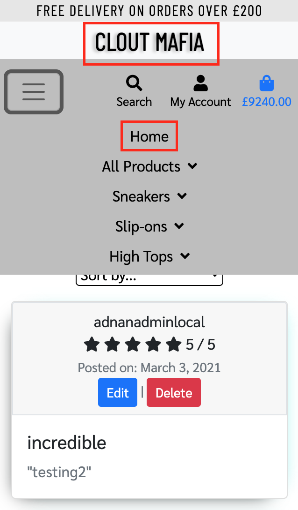

- <h2> Colour Scheme for the Navigation bar</h2>

    - Problem

        - On a tablet and mobile device, the navigation bar was all one colour which was hard to identify which navigation the user is using.

    - Resolution 

        - Added a different colour scheme to the navigation bar to split the different sections more clearly on responsive devices.

    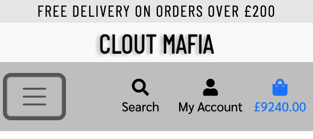

- <h2> Admin Access</h2>

    - Problem

        - Admin user would need to change the URL by adding "/admin" to be directed to the Django admin page

    - Resolution

        - Added a "Admin Home" option to the account drop down which is only visible to the admin user. This would residrect them to the admin portal.

    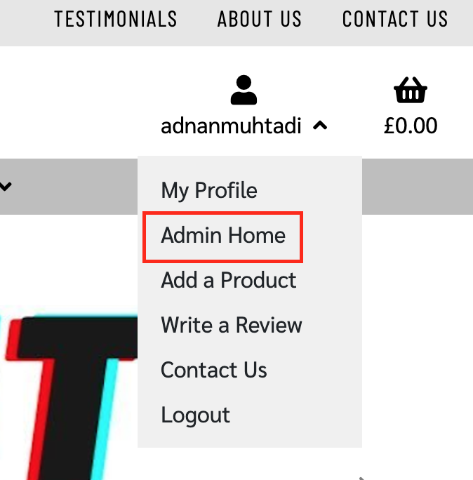

- <h2> Back to the Top button (js)</h2>

    - Problem

        - When scrolling down to the bottom of the page, it can be a hassle for the user to want to scroll back to the top/

    - Resolution

        - Added a back to the top button which would only appear as soon as the page scrolls a certain amount.

    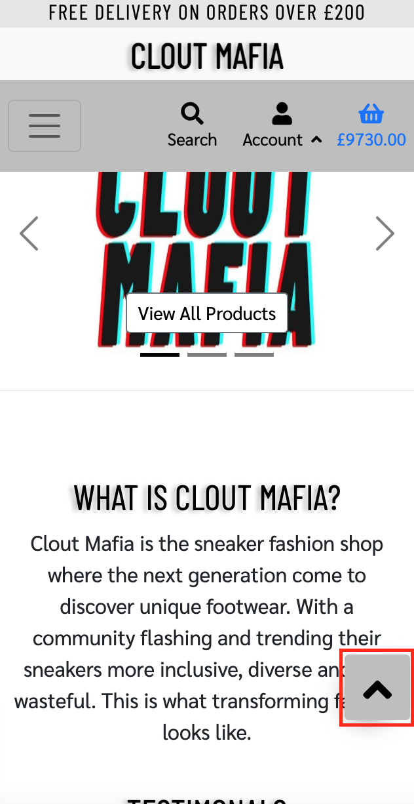
    
- <h2> Dropdown toggle with arrow (js)</h2>

    - Problem

        - Lack of UX design when clicking on the navigation bar dropdown options.

    - Resolution

        - Added up and down arrows using a JS script which would switch when clicked on.
    
    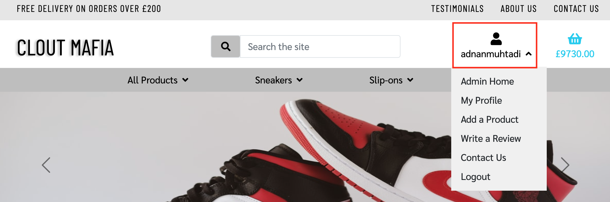

- <h2> Edit and Delete anchor/buttons </h2>

    - Problem

        - Lack of UX design when a user/admin would like to edit or delete either a testimonial or product as they looked as standard links.

    - Resolution

        - Added styling to the anchor tags to make them look like buttons with a hoover over effects which would slide and display an icon.

    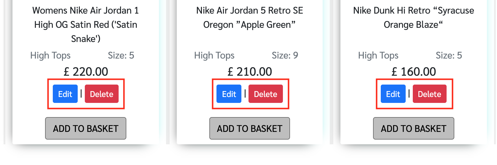

- <h2> Titles and headers </h2>

    - Problem

        - Titles and headers looked very similar with basic styling around the site which made it difficult to tell which is which.

    - Resolution 

        - Amended the styling for the titles to have a shadow like the main logo of the site and headers to remain the same type of styling.

    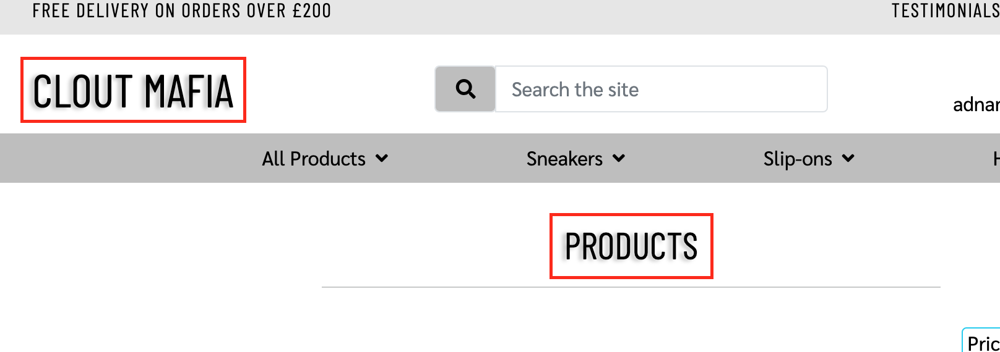

- <h2> Search Results Toast </h2>

    - Problem

        - When using the search feature, no Toast would appear if the search is empty, if no results are found, or if found result.

    - Resolution

        - Created a notification so if the user searches without inputting any data, an error would appear, a notification to show if no results appear and a notification when there are results.
    
    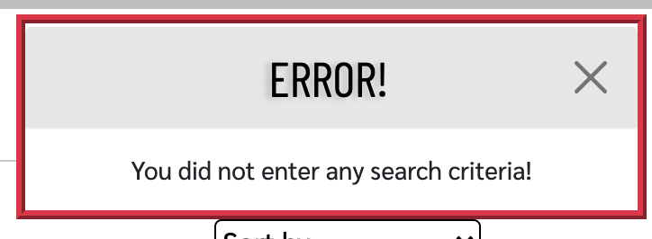
    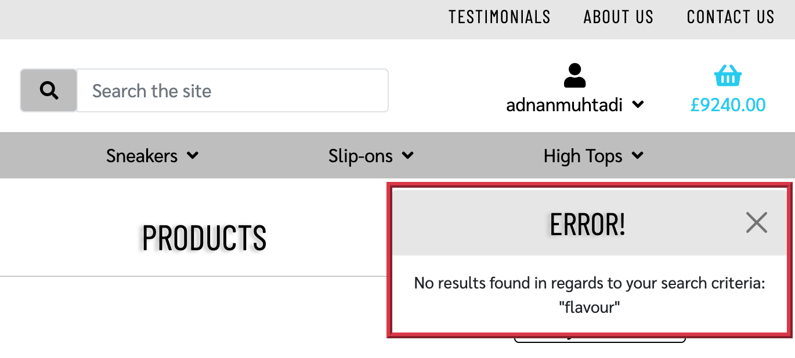
    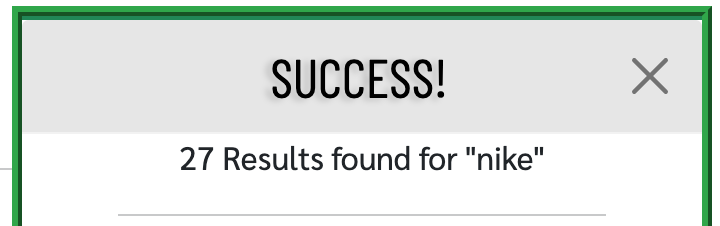

## Toasts

- <h2> Toasts Not Appearing on Product Detail Page </h2>

    - Problem

        - When visiting the product detail page and adding the item to the basket, a toast would not appear to confirm that the product has been added to the basket.

    - Resolution

        - Reviewed the code and found in the HTML code that I included too many Django template if statements, once I refined the code and removed the multiple if statements, the feature worked as expected. 

    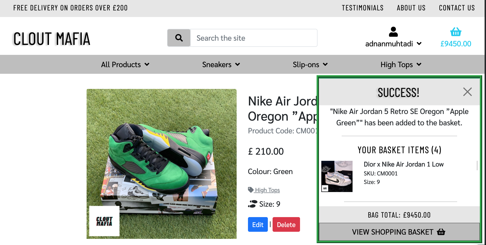

- <h2> Toasts positioning and styling </h2>

    - Problem

        - On tablet and mobile devices, the toasts were loading at different distances from the top of the screen which made the design look inconsistent. On mobile devices, when the toasts load, the background for the toasts would be covering the background of the site. The toasts were not visually attractive as styling was limited for all different types of toasts.

    - Resolution

        - Also amended the media queries for the positioning to be the same between the top and the toast across all devices. Misplaced the background styling to the wrong div. Once corrected, the background for the toats allowed the content to be more readable and once adding further styling, the toast was more visually appealing.

    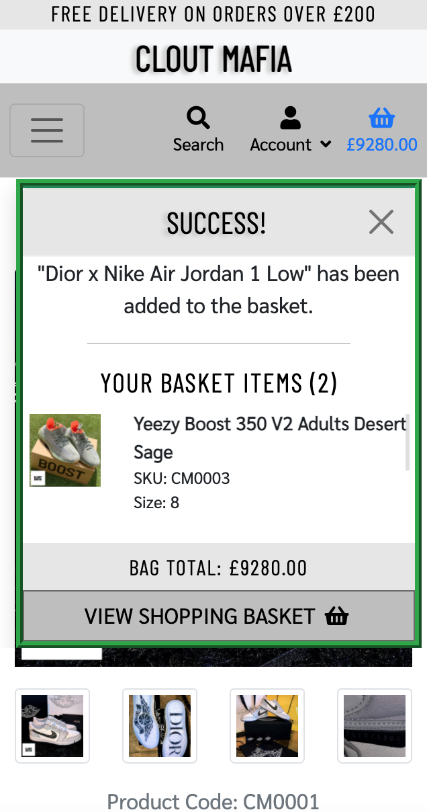

## HTML Validation

- <h2> HTML Validation errors </h2>

    - Problem

        - HTML Validation was misread and misunderstood during the validation checks which lead to several different HTML files failing when running  the Validation checks of the HTML files
    
    - Resolution

        - Reviewed all HTML files and made amendments depending on the errors that were being shown. I then checked them against the W3C HTML Validator by copying them via the URL method.

## Security

- <h2> Editing/deleting testimonials by amending the URL  </h2>

    - Problem

        - Any user would be able to edit/delete a testimonial by amending the URL which is a security breach

    - Resolution

        - I amended the 'if' statement so that both superuser and the user that created the testimonial, would be able to edit and/or delete a testimonial. Other registered users will not be able to edit or delete other user testimonials and cannot gain access to other users testimonials by manipulating the URL.

    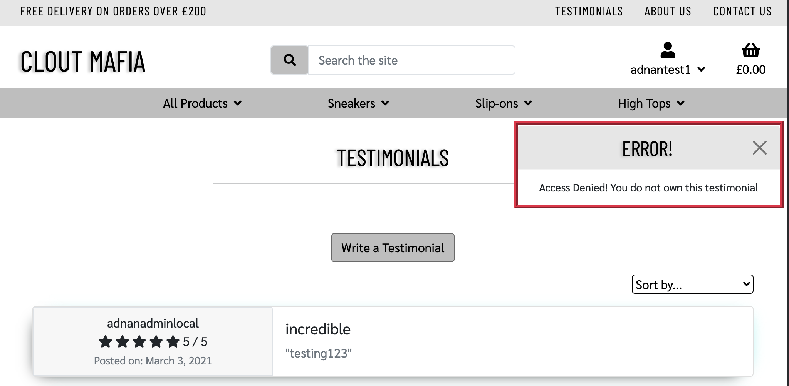