<h1 align="center">User Story Testing</h1>

- As a user, I want to be able to view a list of products, so that I can purchase one of them. 
    1. Upon entering the site, the navigation bar will have categories displayed
    1. Select one of the categories and you would present with one of the options
    1. Select 'All Products' and you will have all the products available

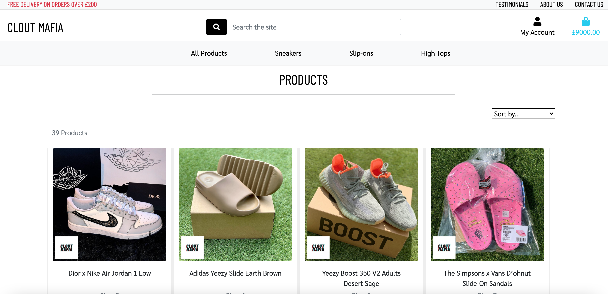

- As a user, I want to be able to view the details of an individual item, so I can see the price, description, product image.
    1. Upon entering the site, the navigation bar will have categories displayed
    1. Select one of the categories and you would present with one of the options
    1. Select 'All Products' and you will have all the products available
    1. Click on the image of a product
    1. A page would load with all the details of the product

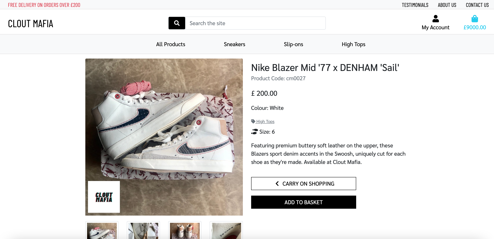

- As a user, I want to be able to sort the sneakers, so I can identify the best priced and alphabetically 
    1. Upon entering the site, the navigation bar will have categories displayed
    1. Select one of the categories and you would present with on of the options
    1. Select 'All Products' and you will have all the products available

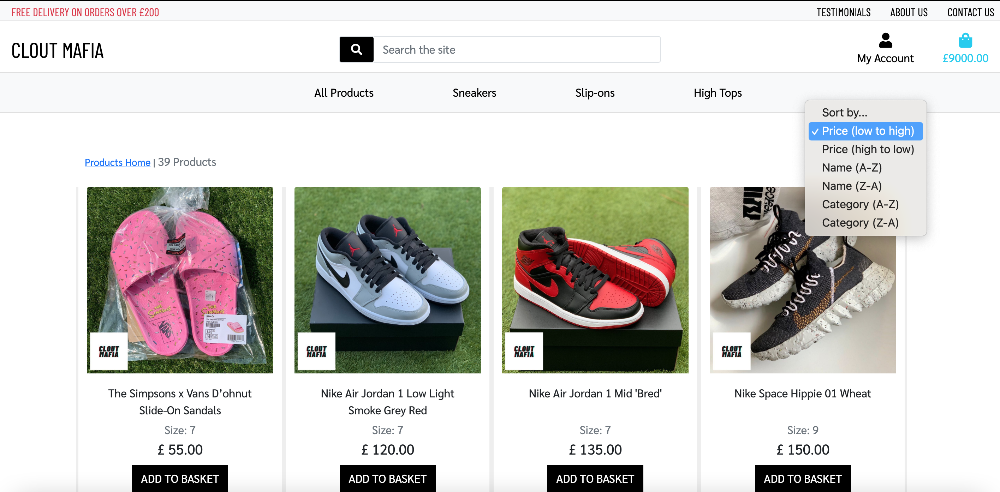

- As a user, I want to be able to sort a specific category of sneakers, so I can find the specific sneakers I am looking for
    1. Upon entering the site, the navigation bar will have categories displayed
    1. Select one of the categories and you would present with one of the options
    1. Select 'High-Tops' and you will have all the products that are in the 'High-Tops' category

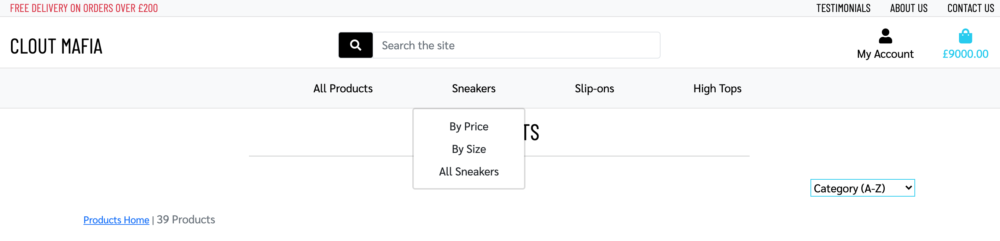

- As a user, I want to be able to search by name and/or description, so I can find sneakers easily
    1. Upon entering the site, the navigation bar with a search bar will be displayed
    1. Enter 'adidas' in the search criteria
    1. You will on see sneakers which have the word 'adidas' in either the name or description

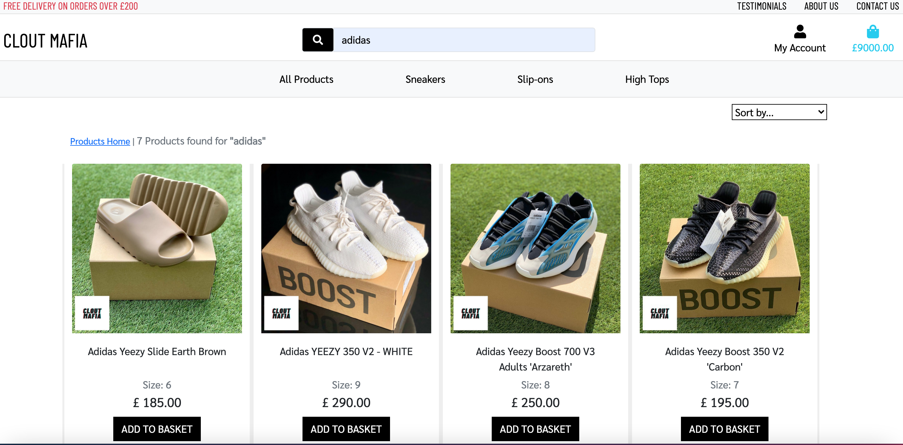

- As a user, I want to be able to see the number of results that appear from my search, so I can see how many sneakers are available from my search
    1. Upon entering the site, the navigation bar with a search bar will be displayed
    1. Enter 'adidas' in the search criteria
    1. On display, you will see the number of results that came with your search

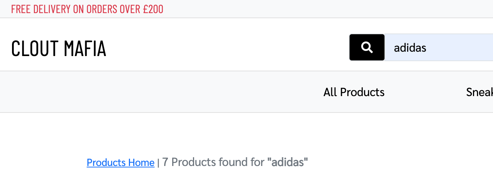

- As a user, I want to be able to easily register for an account, so I can have a personal account within the site and be able to view my personal information
    1. Upon entering the site, the navigation bar will have an option 'My Account'
    1. When clicking on it, a drop-down would appear.
    1. Once you click on 'Register', a new page would appear where you can fill out your details

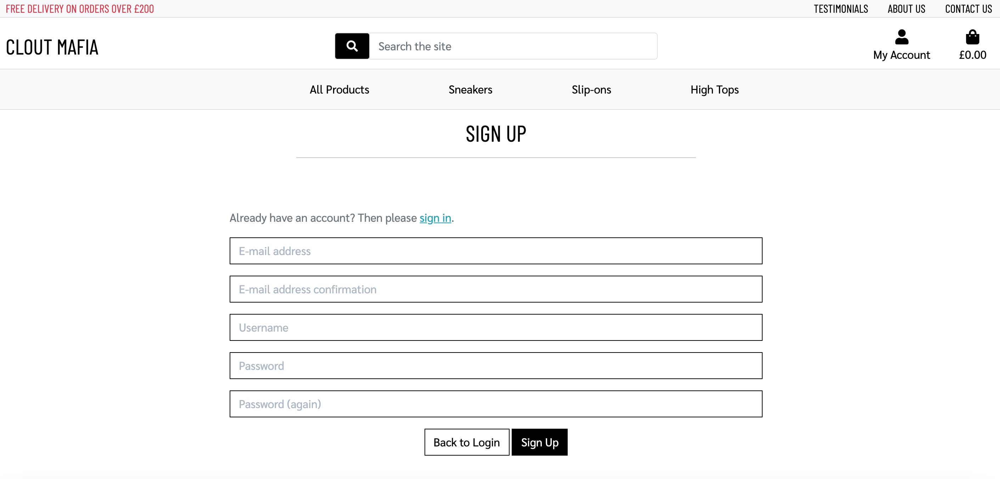

- As a user, I want to be able to view a personalized profile page, so I can view my personal information as well as my order history
    1. Upon entering the site, the navigation bar will have an option 'My Account'
    1. When clicking on it, a drop-down would appear.
    1. Once you click on 'login', a new page would appear where you would need to log in.
    1. Once logged in, you would be redirected back to the home page.
    1. Follow the same process by click on 'My Account' and in the drop-down, click on 'My Profile'
    1. A new page would appear with your information as well as your order history.

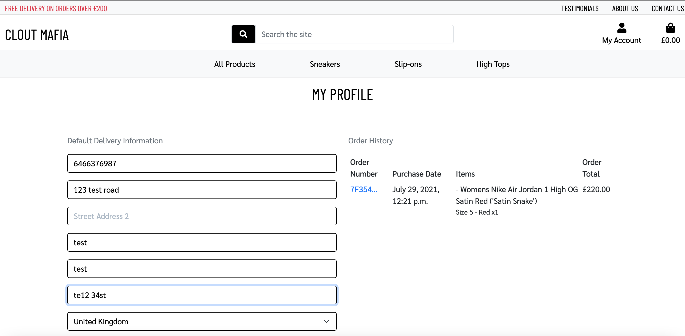

- As a user, I want to be able to view the overall total of my shopping bag, so I can see my total spending
    1. Upon entering the site, the navigation bar will have a shopping cart (this will be displayed throughout the site)
    1. When clicking on the shopping cart, a new page will be displayed with the products on it
    1. The page will display the total as well as an itemized breakdown of your order

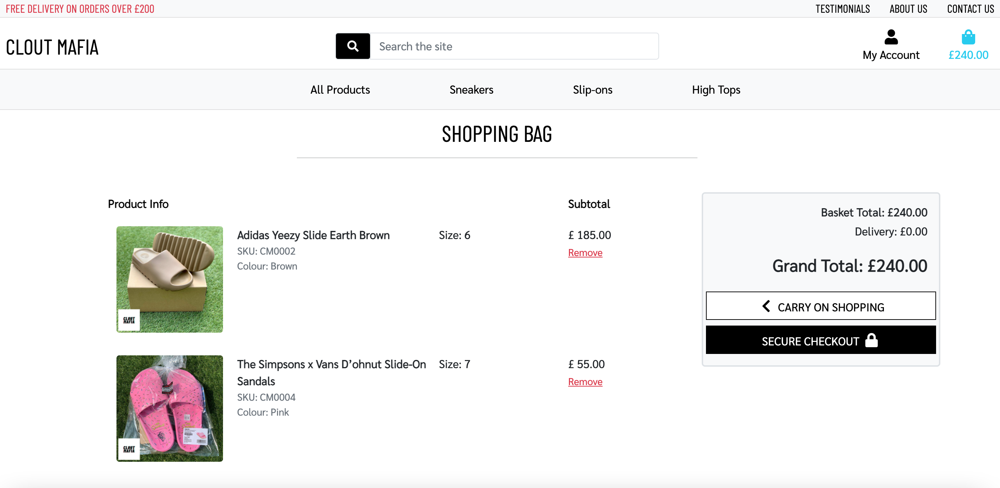

- As a user, I want to be able to delete an item from my basket at the checkout stage, so I can have the option to change my mind if I don’t want to purchase the item
    1. Upon entering the site, the navigation bar will have categories displayed
    1. Select one of the categories and you would present with one of the options
    1. Select 'All Products' and you will have all the products available
    1. When clicking on the shopping cart, a new page will be displayed with the products on it
    1. As the summary is displayed, you would have the power to delete the item

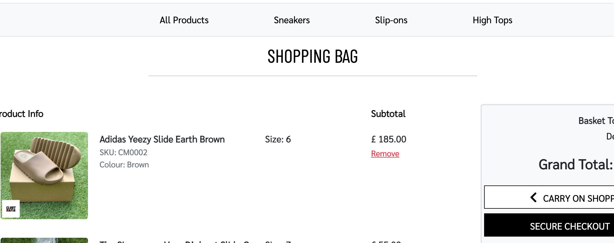

- As a user, I want to be able to easily enter my payment details, so I can easily purchase my items
    1. Upon entering the site, the navigation bar will have categories displayed
    1. Select one of the categories and you would present with one of the options
    1. Select 'All Products' and you will have all the products available
    1. When clicking on the shopping cart, a new page will be displayed with the products on it
    1. As the summary is displayed, a 'Secure Checkout' button appears, when clicked on
    1. A new page is displayed with a place where you can insert the delivery details as well as the card details

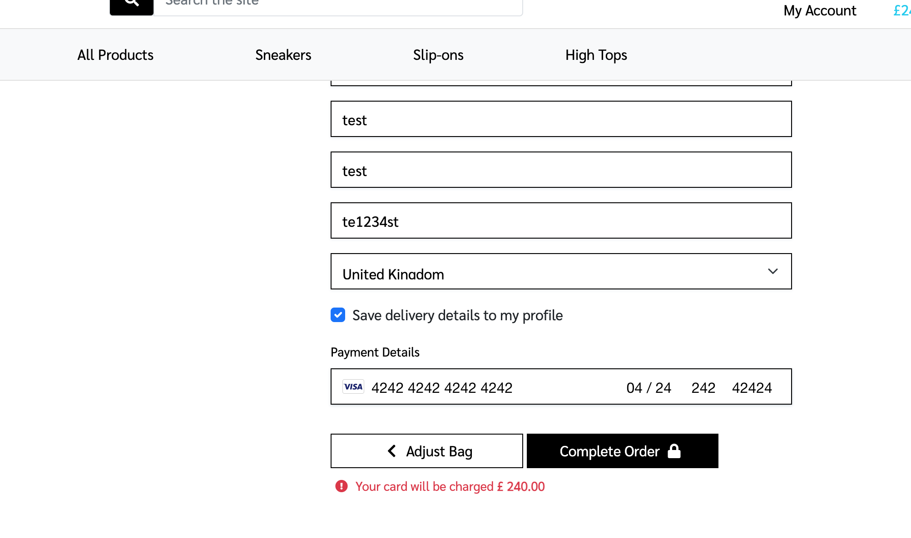

- As a user, I want to be able to view an order confirmation after I have purchased my items, so I can verify my purchase order.
    1. Upon entering the site, the navigation bar will have categories displayed
    1. Select one of the categories and you would present with on of the options
    1. Select 'All Products' and you will have all the products available
    1. When clicking on the shopping cart, a new page will be displayed with the products in it
    1. As the summary is displayed, a 'Secure Checkout' button appear, when clicked on
    1. A new page is displayed with a place where you can insert the delivery details as well as the card details
    1. Once the form is complete, Click on 'Complete Order', 
    1. Another page would appear with the order details

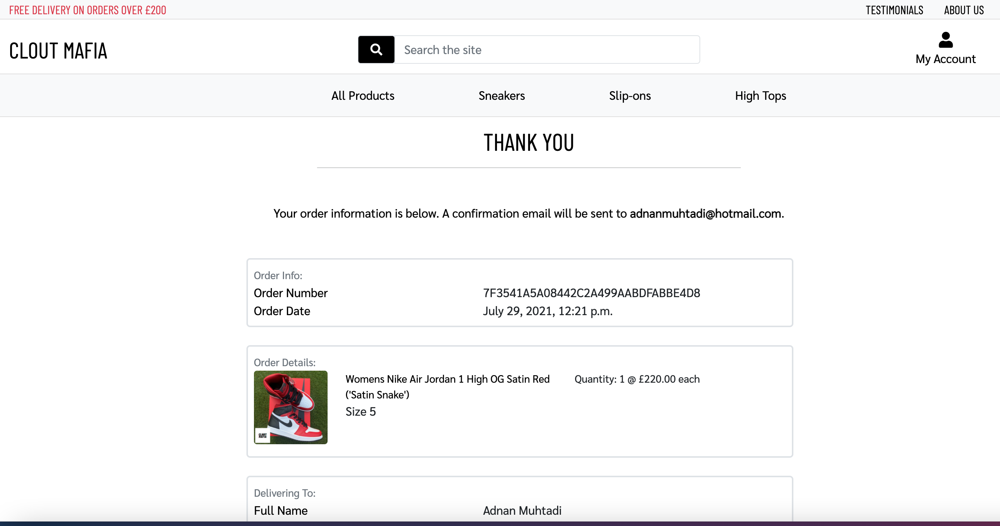

- As a user, I want to be able to post a testimonial, so I can express my opinion of the service/website.
    1. Upon entering the site, the navigation bar will have an option 'My Account'
    1. When clicking on it, a drop-down would appear.
    1. Once you click on 'Add Testimonial', a new page would appear where you can post a testimonial.

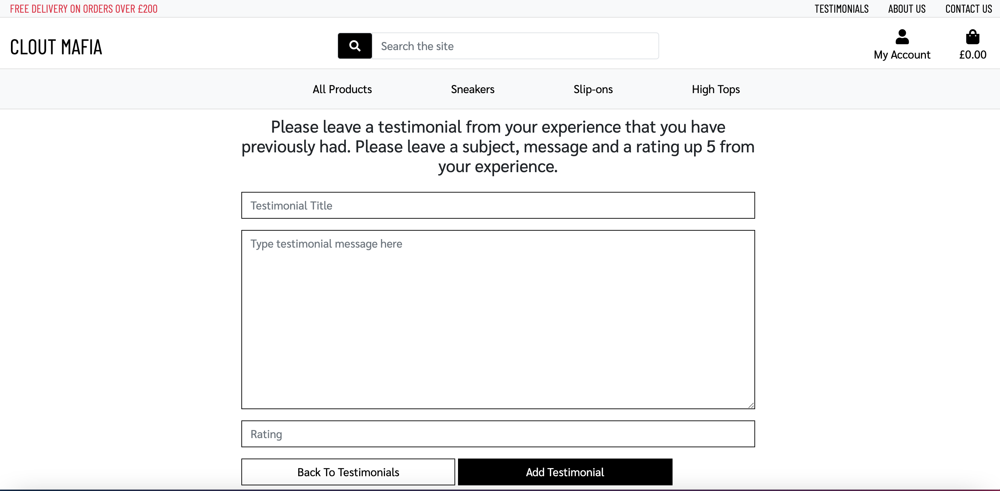

- As a user, I want to be able to see the products that have already been sold, so I can see the other types of products I have missed out on and what this company has already sold
    1. Upon entering the site, the navigation bar will have categories displayed
    1. Select one of the categories and you would present with one of the options
    1. Select 'All Products' and you will have all the products available
    1. When you scroll through the list of products

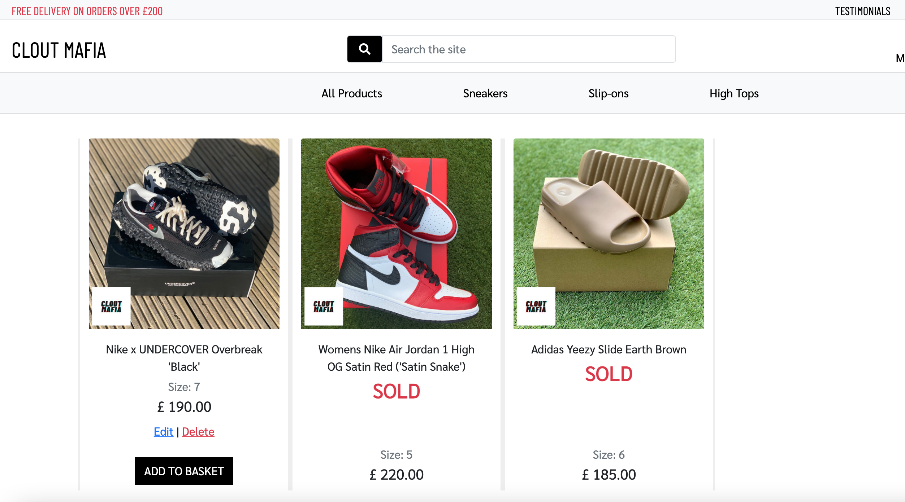

- As a site owner, I want to be able to add a product, so I can add a new pair of sneakers to my store
    1. Upon entering the site, the navigation bar will have an option 'My Account'
    1. When clicking on it, a drop-down would appear.
    1. Once you click on 'Add Product', a new page would appear where you can create a new product.

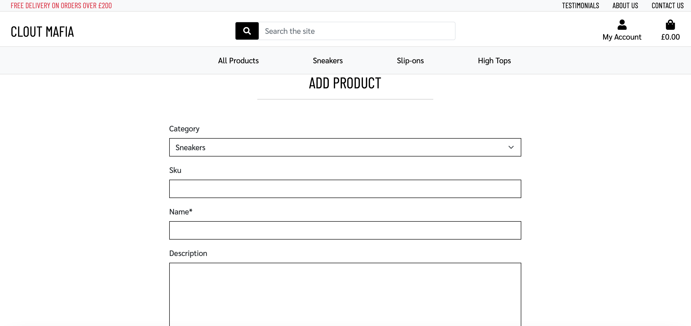

- As a site owner, I want to be able to edit, update a product in my store, so I can amend the name, price, description, image and any other product details
    1. Upon entering the site, the navigation bar will have categories displayed
    1. Select one of the categories and you would present with one of the options
    1. Select 'All Products' and you will have all the products available
    1. On each product, you will have the option be able to edit a product at any time.
    1. Once clicked on, a new page with the details of the product will be displayed and available to amend

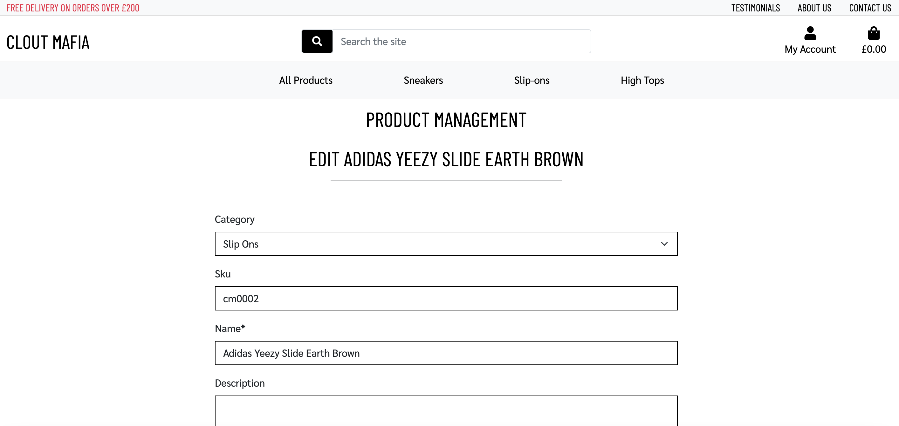

- As a site owner, I want to be able to delete a product, so I can remove the product from my store.
    1. Upon entering the site, the navigation bar will have categories displayed
    1. Select one of the categories and you would present with one of the options
    1. Select 'All Products' and you will have all the products available
    1. On each product, you will have the option be able to delete a product at any time.

    or

    1. Upon entering the site, the navigation bar will have categories displayed
    1. Select one of the categories and you would present with one of the options
    1. Select 'All Products' and you will have all the products available
    1. Click on the image of a product
    1. A page would load with all the details of the product
    1. You will have the option be able to delete a product

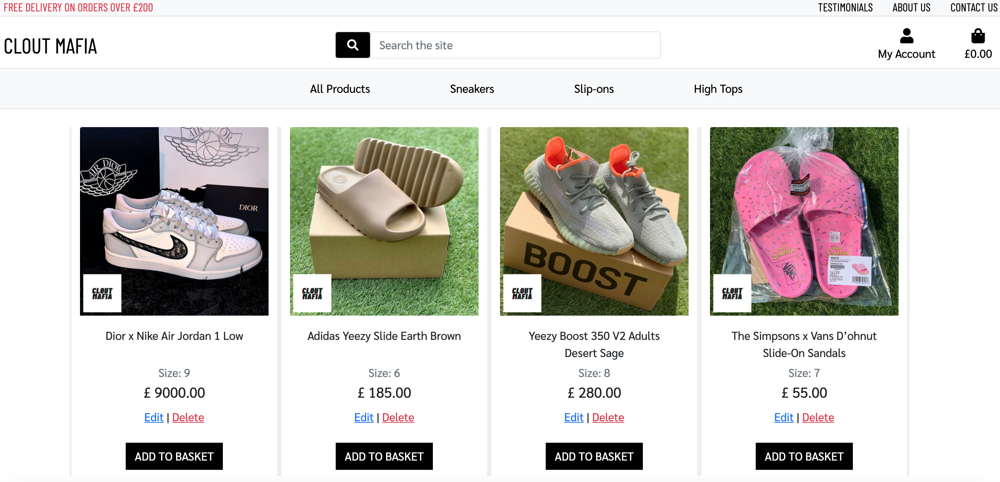

- As a site owner, I want to be able to see a list of emails that get sent within the Django admin page, so I can see what users are mostly asking 
    1. Upon entering the site, add /admin/ to the URL to make it look like this https://clout-mafia-ms4.herokuapp.com/admin/
    1. Login with the login permissions, and scroll down on the left hand side to 'Contact Us'
    1. Once loaded, you will be able to see all the message sent to the site admins

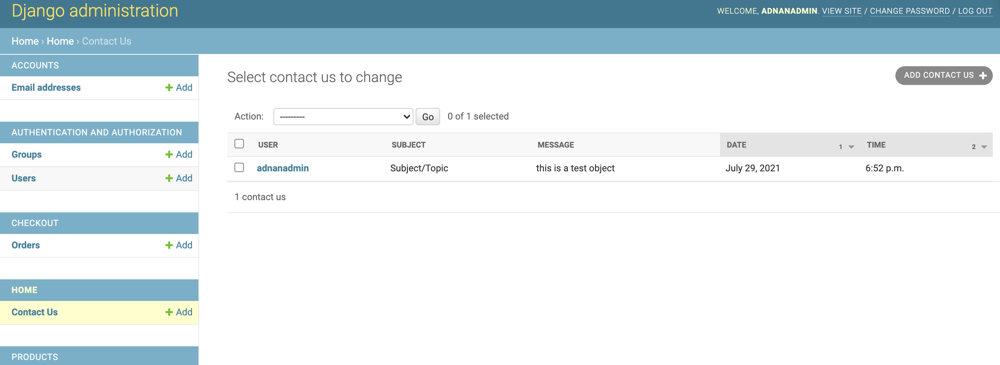

[Return to main README.md](https://github.com/adnanmuhtadi/milestone-project-4)